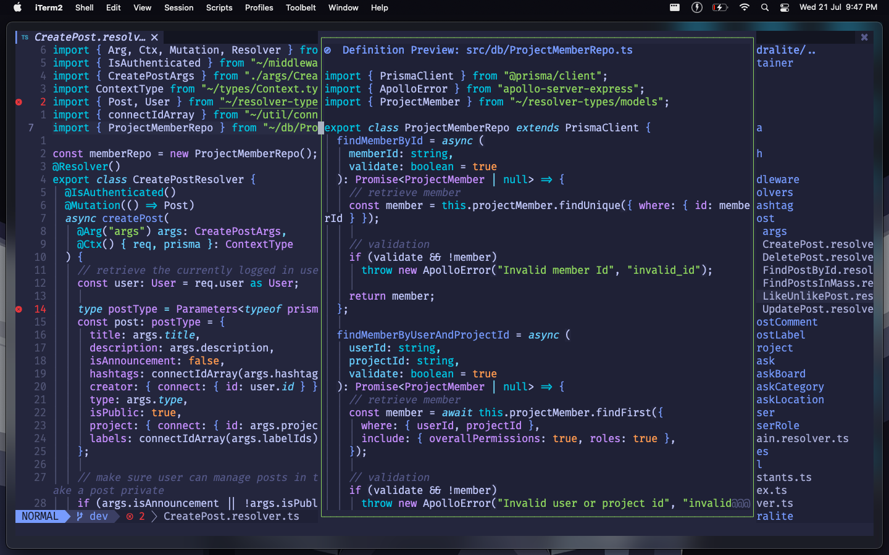
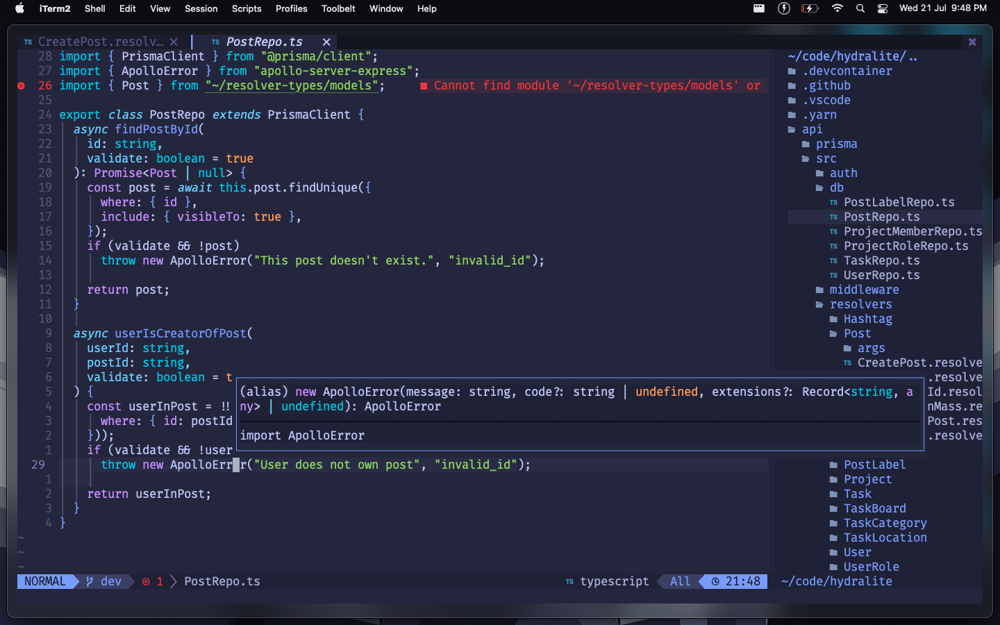

# kyoto.nvim
<p align="center">
  
</p>

kyoto.nvim is a fast ⚡, simple and minimal Neovim configuration that aims to replace Graphical IDEs such as Visual Studio Code and Sublime Text.

## Features

- LSP Support (with Autocomplete)
- Ergonomic keybinds
- Blazing Fast File Explorer
- Really customizable (seriously, you should check it out)

## Screenshots






## Supported Languages

Find a list of supported languages [here](https://github.com/kabouzeid/nvim-lspinstall/tree/main/lua/lspinstall/servers). To install any of them run
```
:LspInstall <language server name>
```
## Notable Plugins

- packer.nvim
- nvim-tree.lua
- lspsaga.nvim
- tokyonight.nvim
- dashboard-nvim
- telescope.nvim
- nvim-bufferline.lua
