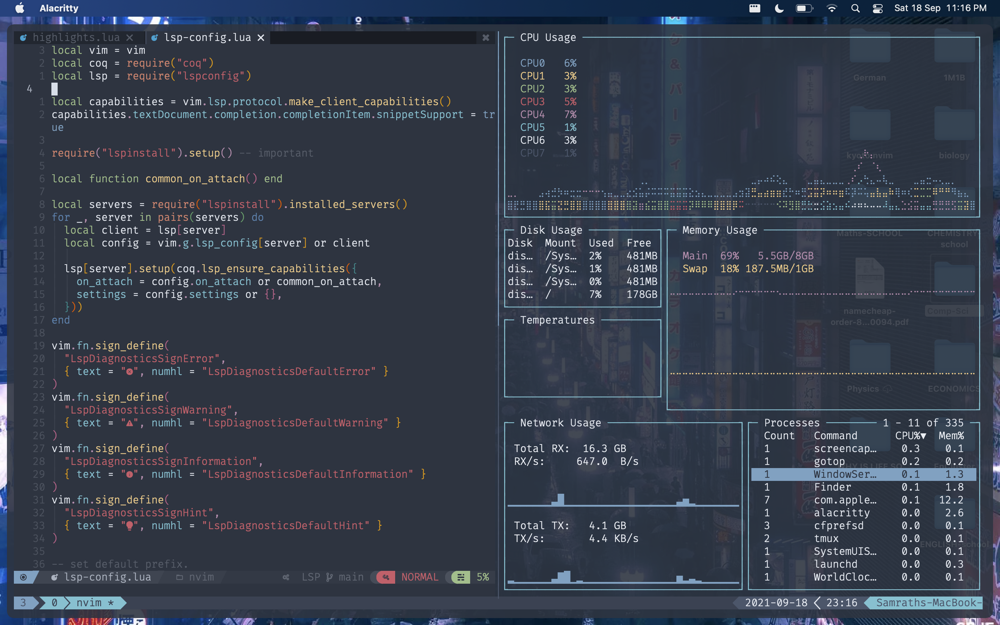
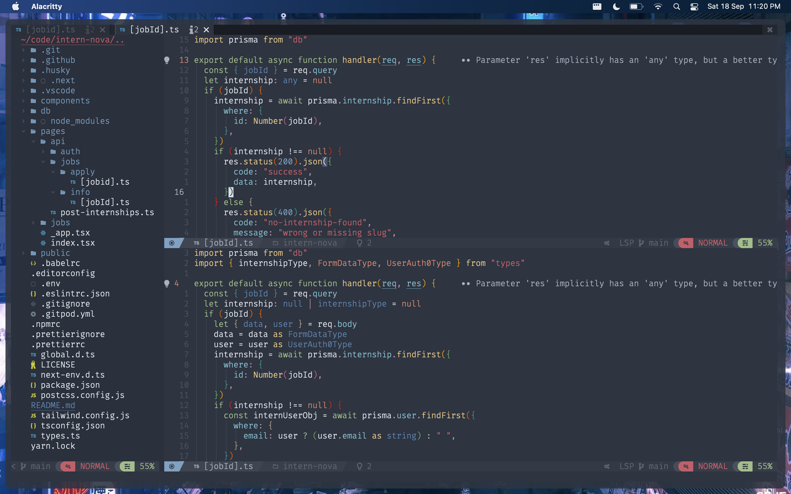

<h1 align="center">🦚 kyoto.nvim</h1>

<p align="center">kyoto.nvim is a fast ⚡, functional, beautiful, and highly customizable neovim configuration</p>

### Installation

Find an [installation guide here](https://github.com/samrath2007/kyoto.nvim/wiki/Installation).

## Features

- LSP Support (with Autocomplete)
- Ergonomic keybinds
- Blazing Fast File Explorer
- Really customizable (seriously, you should check it out)

## Screenshots




## Supported Languages

### LSP

You can find a list of supported languages [here](https://github.com/kabouzeid/nvim-lspinstall/tree/main/lua/lspinstall/servers). To install any of them run

```
:LspInstall <language server name>
```

## Notable Plugins

- nvim-tree.lua
- lspsaga.nvim
- nvim-base16.lua
- dashboard-nvim
- telescope.nvim
- nvim-bufferline.lua
- lazygit
- feline.nvim

## Sponsors

<p>
  <a href="https://github.com/InternNova-Labs/InternNova/"><h2>InternNova</h2>
    
  </a>
</p>


## Discord
##### Doubts? join our <a href="https://discord.com/invite/2ZtCvPYUv5">discord server</a>

### Core contributors
- samrath2007
- itscarlosecp
- Pyther99

<a href="https://discord.com/invite/2ZtCvPYUv5"></a>
